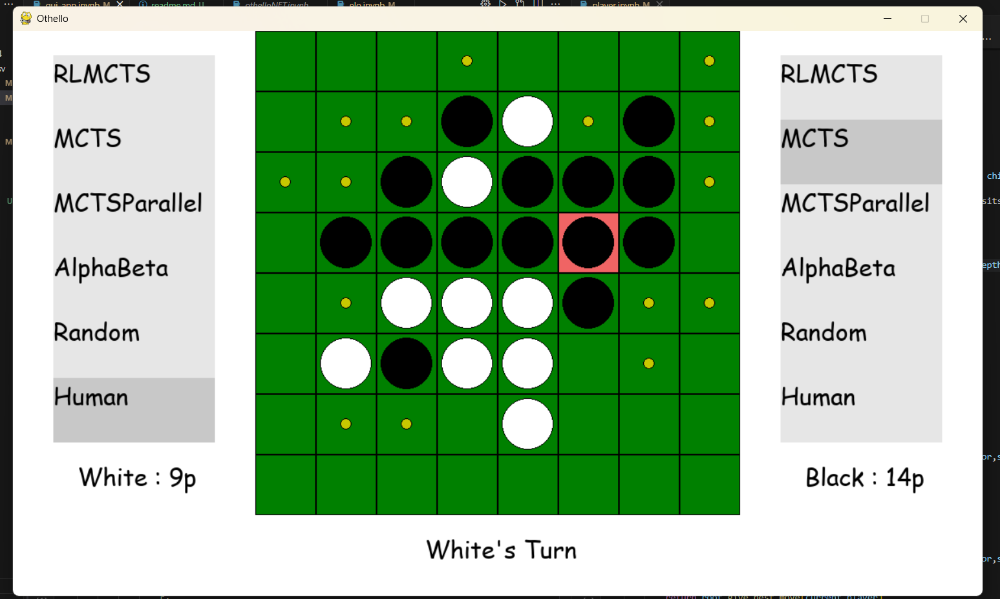
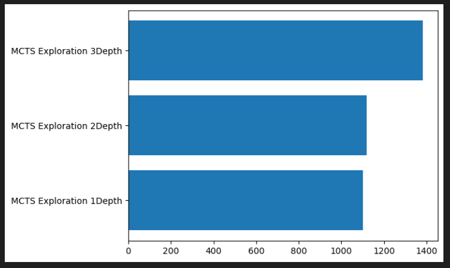
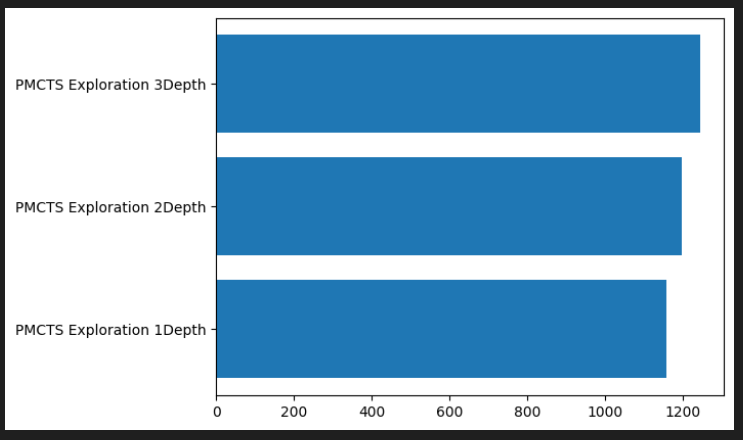
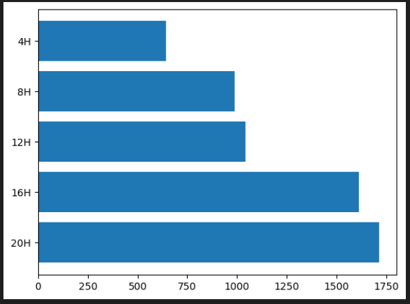

# OTHELLO BOT

This project is a collection of Bots which can play othello against each other and YOU. As well as Utility to calculate their relative elos. 
 
## Game Rules

Othello, also known as Reversi, is a classic board game played on an 8x8 grid. The game involves two players, one controlling black pieces and the other controlling white pieces. The objective is to have the most pieces of your color on the board when the game ends.

### Starting Position

The game starts with a central arrangement of four discs: two white and two black discs, placed diagonally to each other. The black player makes the first move.

### Gameplay

1. Players take turns placing their discs on the board.
2. A player can place a disc in a position that encloses the opponent's discs in a straight line (vertical, horizontal or diagonal). 
3. All opponent's discs between the newly placed disc and another disc of the player's color are flipped to the player's color.
4. A move is valid only if it results in at least one opponent's disc being flipped.
   
### Ending the Game

The game ends when:
- The entire board is filled with discs.
- Any player has no valid moves.

### Scoring

At the end of the game, the player with the most discs of their color on the board wins.

for greater detail visit - https://www.worldothello.org/about/about-othello/othello-rules/official-rules/english
# Preliminaries

#### State Formulation

The State of the board is represented as a 8x8 2-D Array. With 
- board[x][y] == 0 : Blank Tile
- board[x][y] == 1 : White Tile
- board[x][y] == 2 : Black Tile

#### Transitions
Transistions are decided by checking all blank spots and then checking with the rules provided above

## Algorithms Used by the Various Players

Algorithms Used in Othello Bot
### 1) Alpha Beta Pruning

Alpha Beta Pruning is an optimization technique for the Minimax algorithm that significantly reduces computation time by pruning branches that cannot influence the final decision. Instead of searching the entire game tree, it selectively evaluates only the most promising paths.

Key features include:

Alpha represents the best (highest) value the maximizing player can guarantee, initially set to negative infinity

Beta represents the best (lowest) value the minimizing player can guarantee, initially set to positive infinity

Pruning occurs when Alpha ≥ Beta, as further exploration becomes unnecessary

This optimization allows for deeper searches without affecting the final result

In the best case scenario (when best moves are searched first), Alpha Beta Pruning reduces complexity from O(b^d) to approximately O(√b^d), where b is the branching factor and d is the search depth. This significant efficiency improvement enables the bot to look further ahead in the game, resulting in stronger play.

### 2) Monte Carlo Tree Search

Monte Carlo Tree Search (MCTS) is a heuristic search algorithm particularly effective for games with high branching factors. It builds a search tree by focusing computational resources on the most promising moves based on random sampling of the search space.

Each iteration of MCTS consists of four key steps:

Selection: Start from the root node and select successive child nodes until reaching a leaf node

Expansion: Create one or more child nodes from the selected leaf

Simulation: Complete a random playout (rollout) from the new node to determine game outcome

Backpropagation: Update information in all nodes on the path from the new node to the root

MCTS is particularly valuable for Othello because it doesn't require a sophisticated evaluation function, instead relying on complete random playouts to estimate position value. This makes it effective even without deep domain knowledge of the game.

Expansion is decided via UCT

Upper Confidence Bound applied to Trees (UCT) formula is used in Monte Carlo Tree Search algorithms to balance exploration and exploitation during the selection phase. The formula is:

$$UCT(v_i) = \overline{X}_i + C \sqrt{\frac{2\ln{N}}{n_i}}$$

Where:
- $UCT(v_i)$ is the UCT value for node $v_i$
- $\overline{X}_i$ is the average reward (win rate) from node $v_i$
- $n_i$ is the number of times node $v_i$ has been visited
- $N$ is the number of times the parent node of $v_i$ has been visited
- $C$ is the exploration parameter (typically $\sqrt{2}$)

The first term ($\overline{X}_i$) represents exploitation (favoring nodes with high win rates), while the second term ($C \sqrt{\frac{2\ln{N}}{n_i}}$) represents exploration (favoring less-visited nodes).
During the selection phase of MCTS, the algorithm chooses the child node with the highest UCT value.

### 3) AlphaZero-type Monte Carlo Tree Search

AlphaZero represents a advancement in game AI by combining MCTS with deep neural networks. Rather than using random playouts, AlphaZero employs a neural network to evaluate positions and guide the search process.

The neural network takes the board state as input and outputs:
- A probability distribution over possible moves (p(s))
- A value prediction estimating which player will win (v(s))

This approach offers several advantages:

The neural network is trained through self-play, learning patterns and strategies without human knowledge

It provides more informed tree growth, focusing on promising variations

## Usage of Player Classes

### Initialisation of the Player Classes

### 1) AlphaBetaPlayer

    def __init__(self,depth = 2)

Just needs the depth parameter to specify how deep the search is

### 2) MCTSPlayer

    def __init__(self,explorationFactor = 1,rollouts = 100,selectionDepth = 1,timeLimit = 5.0,timed = False):

Uses the parameter 'timed' to see whether you want to limit the search by time or rollouts
To Limit by Time - Set timed = True and timeLimt = [YOUR TIME LIMIT]
To Limit by Rollouts - Set timed = False and timeLimt = [YOUR ROLLOUT COUNT]
### 2) MCTSParrallelPlayer

    def __init__(self,explorationFactor = 1,rollouts = 800,selectionDepth = 2,num_threads = 4,timed = False,timeLimit = 3.0):

Similar to MCTSPlayer but need number of threads to be used specified as well

### 3) RLMCTSPlayer

    def __init__(self, explorationFactor=1.4, rollouts=400, selectionDepth=4, timeLimit = 3.0,timed = False,checkpointNUM = 0):

similiar to MCTSPlayer 
checkpointNUM is to keep track of checkpoints in training of player
training is done by using self.train and a checkpoint is saved after every call to self.train

### 4) RandomPlayer

    def __init__(self):

No Setup needed this guy just plays random moves

### Geting the players to play

All player classes have the function 'get_move' with same call signature
Taking agruments board and current_player

It returns the next move assuming the bot is current_player
current_player == 2 -> Black
current_player == 1 -> White

## GUI INTERFACE

The GUI interface can be accessed by running gui_app.ipynb
It consists of the board and selectors for both players(White and Black)
with piece counts at the bottom

Simply chose who you want playing which side and start to play

You can play
- human against human
- human against ai
- ai against ai

## ELO TESTING

ELO was used to see what choice of selection_depth and training time will be best for the bots

#### 1) MCTS - Parameter SelectionDepth

Best selection depth is 3

#### 2) ParrallelMCTS - Parameter SelectionDepth

Best selection depth is 3

#### 3) AlphaZero type MCTS - Parameter Hours of training

Model is getting better with training but the benifits are diminishing

## Comparison between models 

ELO between the approaches

